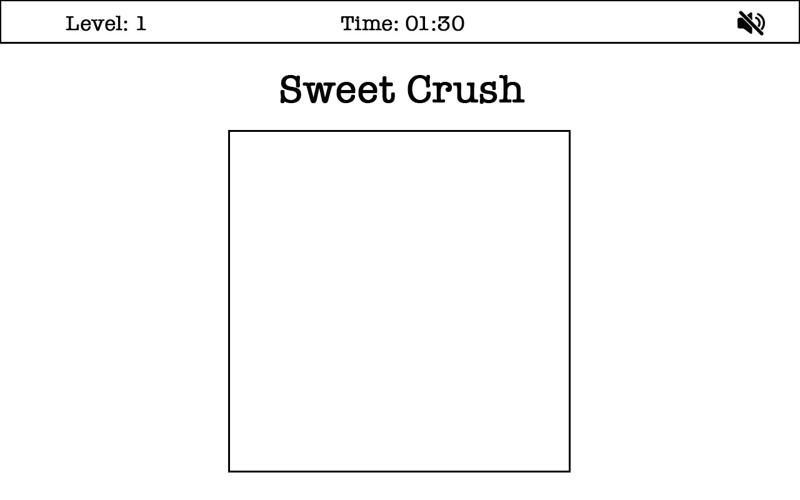

# Sweet Crush

<!-- _An online match-three puzzle game_ -->

[Live Site]()

## Background and Overview

Sweet Crush is a match-three puzzle game. 

## Functionality and MVP

In Sweet Crush, users will be able to 

- [ ] See a populated board of sweets 
- [ ] Eliminate three sweets by swapping certain two sweets
- [ ] Eliminate the whole row or column by swapping certin two sweets
- [ ] Win current level and move on to next level

Bonus function:
- [ ] Games are finished in a timed environment or swapp-limit environment
- [ ] Four or more identical sweets can become the one more powerful sweet and stays in the board
- [ ] Give User hint when long time no activity 

## Wireframes

## Architechture & Technologies

This project will be implemented with the following technologies:

- `Vanilla JavaScript` for overall structure and game logic,
- `HTML5 Canvas` for DOM manipulation and rendering,
- `Web Audio API` for sound generation, processing and control. `WebAudioAPI` allows for simultaneous sounds with more dependable time triggering

In addition to the webpack entry file, there will be other scripts involved in this project:

`board.js`: this script will handle the logic for creating and updating the necessary DOM elements.

`sweets.js`: this script will house the swaps logic for the sweets.

`audio.js`: this script will handle the audio logic and the creation of AudioEvents based on the input parameters outlined above.
  

## Implementation Timeline

#### Day 1 - Oct 29

- Finish proposal
#### Day 2 - Oct 30

- Research and plan the game
#### Day 3 - Oct 31

- use canvas and code game logic
#### Day 4 - Nov 1

- collision detection, candy elimination and new candy drop
#### Day 5 - Nov 2

- winner detection and shuffle
#### Day 6 - Nov 3

- css polish and sound effect

#### Day 7 - Nov 4

- debug and polish